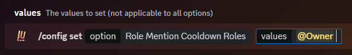
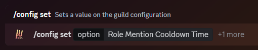
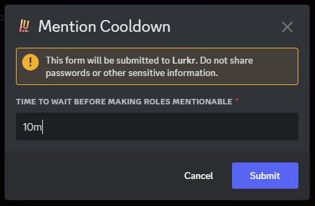

import { SUPPORT_SERVER_INVITE } from "@/shared-links.js";

## Why Would You Need This?

The main use-case of this feature is to have a moderator role mention cooldown.
Many servers like to keep their Moderator role mentionable in case some accident or disaster happens to keep moderators
on stand-by ASAP. However, if this power is given to too many people, eventually there will be people who abuse this and
spam ping moderators constantly, even when there is no emergency.

## Video Tutorial

We currently do not have a video tutorial for this guide just yet, check back later!

## Guide

### Setting up the roles

In order to get started, first, you must set which roles will have a mention cooldown.

Typically, this will be the moderator role or the administrator role, however, it is entirely up to you which role(s) you decide to choose.

To set your role(s), type the following command. You can enter as many roles as your current server plan will allow.
You can check the limits on the Premium Perks page!

<Card href="/docs/premium-perks" title="💰 Premium Perks">
	Check out the Premium Perks!
</Card>

	

### Setting up the cooldown time

The cooldown time can be any time between **5 minutes** and **30 minutes**, and it is the time between when the role mention option is disabled after a mention in a channel to when it is re-enabled.

To set your cooldown time, type the following command:

	

A modal-box will then appear, in which you can then enter the time interval you want to assign.

	

### Final Words

And that's it! You've successfully created automatic role mention cooldowns with Lurkr!

If you need any more assistance with Lurkr, check out the rest of this documentation or join our support server to talk to an actual human!

<Cards>
	<Card href="/docs/troubleshooting" title="🐛 Still need help?">
		Check out the Troubleshooting guide!
	</Card>
	<Card href={SUPPORT_SERVER_INVITE} title="💬 Want to chat with an actual human?">
		Join our support server
	</Card>
</Cards>
