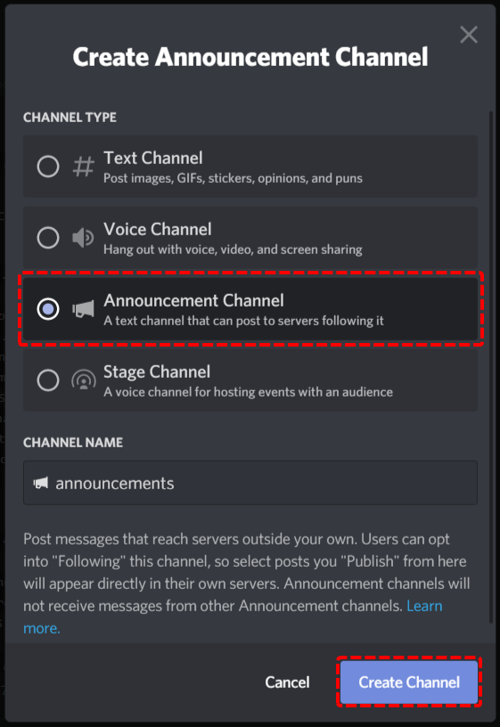
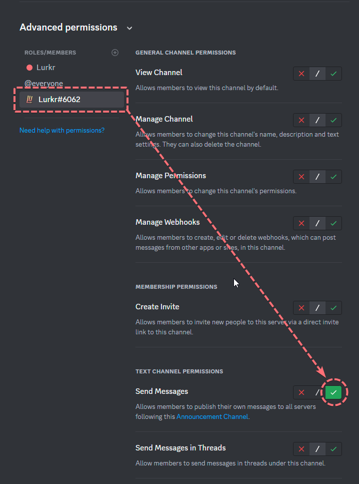
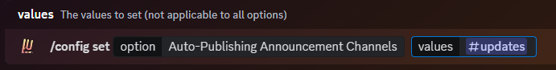

import { SUPPORT_SERVER_INVITE } from "@/shared-links.js";

### Why Would You Need This?

If you haven't heard of them,
[Discord Announcement Channels](https://support.discord.com/hc/en-us/articles/360032008192-Announcement-Channels-) are a
super useful addition to any community server to extend their reach to an audience outside of your own server! But in
order to do that you need to manually click on a little button to make sure that the announcement actually gets pushed
to all of your following servers, and without doubt, have you sometimes just forgotten to click that button!

Well with Lurkr you can set it up to make an announcement channel automatically push out any and all announcements you
send into the channel!&#x20;

### Video Tutorial

We currently do not have a video tutorial for this guide just yet, check back later!

## Guide

### Creating an Announcement Channel

The first step to creating an announcement channel is to enable the community server features, by following this
[guide ](https://support.discord.com/hc/en-us/articles/360047132851-Enabling-Your-Community-Server)by Discord
themselves!

The next step is to create a new channel, and to select as the channel type: 'Announcement Channel'. Give it an
appropriate name and then continue to the next step!

### Giving the Correct Permissions

This next step is quite crucial. By default, Lurkr won't be able to announce any messages in the new channel, and
therefore you need to grant either Lurkr (The Bot Account) or Lurkr (The Integration Role) the **Send Messages**
permission in the newly created announcement channel.

<Callout type="info" title="Bot Permissions">
	Don't worry, the bot will never send any messages on it's own into your announcement channel, it only needs this
	permission in order to announce messages that have already been sent.
</Callout>

### Configuring the Auto Publisher

Finally, we need to tell Lurkr which announcement channel it should automatically publish!

To get started, use the command as shown below!

You can enter as many channels as your current server plan will allow. You can check the limits on the Premium Perks
page!

### Final Words

And that's it! You've successfully created an Automatically Publishing Announcement Channel with Lurkr!

If you require any more assistance with Lurkr, check out the rest of this documentation or join our support server to
talk to an actual human!

<Cards>
	<Card href={SUPPORT_SERVER_INVITE} title="💬 Want to chat with an actual human?">
		Join our support server
	</Card>
</Cards>
