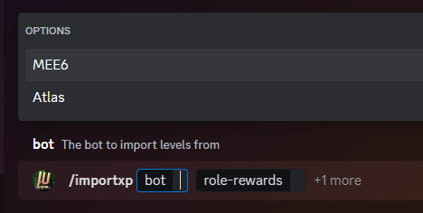
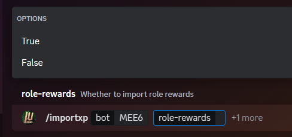
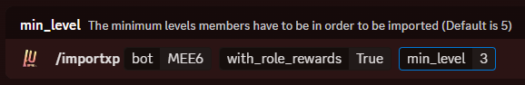
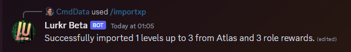

import { SUPPORT_SERVER_INVITE } from "@/shared-links.js";

## Why Would You Need This?

Server Leveling can be a painful transition for already set-up servers, and is very often a pain point when server
owners/admins want to look for a different leveling solution. Lurkr allows you to import all levels and role rewards
from various supported bots and keep your users leveling data completely intact, so they don't have to start from
scratch all over again!

## Guide

<Callout type="warn" title="Please read this section before moving forward to prevent data-loss and unnecessary waiting during the transition!">
    While Lurkr lets you painlessly import all of your leveling data, this feature requires significant processing power. Not only that but we are obligated to retrieve data from other bots within their rate-limits (ie. How fast we can access their website). Because of this, the `/importxp` command can only be used **once every hour**!

    It is therefore important to read through this guide carefully before proceeding!

</Callout>

### Supported Bots

Not all bots are open with their leveling data so that these kinds of transfers are possible. Below is a list of
supported bots that allow for our importing feature to work. Below is also a list of bots that **we know** are not
compatible because they require special authorization on your behalf to access the leaderboard. Since we would never ask
for your Discord credentials, unless these bots change their policies in the future, we **cannot** support them.

| Bot                                     | Leveling Import?   | Role Reward Import? |
| --------------------------------------- | ------------------ | ------------------- |
| [MEE6](https://mee6.xyz)                | ✅                 | ✅                  |
| [Atlas](https://atlas.bot)              | ✅                 | ✅                  |
| [Amari](https://amaribot.com/)          | ✅                 | ✅                  |
| [Polaris](https://gdcolon.com/polaris/) | ✅\*               | ✅\*                |
| [Arcane](https://arcane.bot/)           | ❌ (Not Supported) | ❌ (Not Supported)  |

\* Polaris leveling data can be imported by providing it's JSON data export to @almeida in the support server.

If you want to see this list get expanded, let us know which bot you would like to switch over from in our support
server in the #suggestions channel! We'll let you know if it's technically possible and if enough people are interested,
add it to our feature request list!

<Card href={SUPPORT_SERVER_INVITE}>💬 Support Server</Card>

---

### Import Levels

#### Choose a Bot

Lets get started on importing your levels to Lurkr! In order to use the command the person executing it needs to have
**Administrator** permission, or be the owner of the server!

To start, enter the `/importxp` command and wait for the option fields to be populated. You will now have an option to
choose one of the above supported bots!

---

#### Role Rewards

Click on one of the supported bots, in this guide we will be using MEE6 as an example. Next you will need to choose
whether or not to import role rewards. If you already had some role rewards set up, most likely the answer will be yes,
unless you plan on re-doing your role rewards.

<Callout type="info">
	Since importing role rewards **only** transfers the information which Discord role belongs to which level, the bot
	should not create or move around existing roles.
</Callout>

Click on **True** in order to import the role rewards, or **False** if you just want to import the levels.

---

#### Minimum Level Option

Lastly, you will be prompted with a 'min_level' option. This **optional** field lets you control down to which level you
want to import your users.

For example, if you have many users who are all on level 1 because they only ever spoke 2 words on your server, the
import will skip them entirely. This is mainly useful for large servers (Over \~1,000 members) who might have many
unnecessary users in their leveling leaderboard. This helps reduce the overall processing the bot needs to do.

The **lowest** this value can go is `3`, meaning that if you select `min_level:3`, Lurkr will import all levels until it
reaches level 3 and will then stop importing. The **highest** this value can go is `20`.

<Callout type="info">By default, the `min_level` value is set to 5.</Callout>

---

#### Success?

Once you've sent the command away, Lurkr will now collect all of the relevant data from your old bot and transfer it all
into it's own database. The reply message will update to keep you apprised of the transfer progress.

Once it has finished the message should look like this, and you will be able to use the `/leaderboard` command or the
`/config check` command to double-check if all of your data has been moved over!

---

#### Are We Hypocrites?

So we've stolen all of your leveling data and are now holding it hostage until you pay us right? _**WRONG!**_

We believe in vastly different philosophy than our competitors and as end-users of these kinds of systems ourselves in
the past, we understand the pain and frustrations some of the other options give you.

All of which is why we allow you to export/download your leveling data at **any time**, **instantly** and completely for
free! Check out how in the guide linked below!

<Card href="/docs/guides/exporting-leveling-leaderboard">📃 Exporting Leveling Leaderboard</Card>

---

### Final Words

Congratulations, you should now be the proud owner/administrator of a brand newly imported leveling system powered by
Lurkr!

<Callout type="info">
	If everything went according to plan, check out all of our awesome **free** features that you might like to configure
	for your personal leveling experience!
</Callout>

<Cards>
	<Card href="/docs/troubleshooting" title="🐛 Still need help?">
		Check out the Troubleshooting guide!
	</Card>
	<Card href={SUPPORT_SERVER_INVITE} title="💬 Want to chat with an actual human?">
		Join our support server
	</Card>
</Cards>
