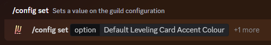
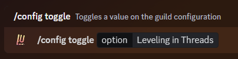

import { SUPPORT_SERVER_INVITE } from "@/shared-links.js";

## Automatically Resetting Levels

Automatically resetting levels can be very useful to keep your server nice and organized, and to punish those you ban
even more!

When the condition you set has been met, Lurkr will automatically delete the affected users level data (If they had any)
without questions.

**Kicking a user has the same effect as leaving though, so be careful!**

You will then receive a drop-down menu from which you can choose what you want the bot to do. You can only choose one at
a time.

| What Will Trigger the Reset?                        | Response Type |
| --------------------------------------------------- | ------------- |
| Nothing                                             | None          |
| When the user leaves the server for whatever reason | Leave/Kick    |
| When the user is banned for whatever reason         | Ban           |
| When the user leaves or when the user is banned     | Both          |

## Ignored Bot Prefixes

You are obviously using more than one bot in your server, and many times users can use bot commands in channels where
you might also want to have leveling enabled.

With Lurkr you can choose whether or not the bot ignores commands, even if they should be counted as a normal leveling
message.

For example if someone uses the command `?hug <User>` and you have the prefix `?` blacklisted, that message won't be
counted as a leveling message.

You can enter as many prefixes as your current server plan will allow. You can check the limits on the Patreon Perks
page!

You will then receive a modal box in which you can enter the message command prefixes you want to be blocked, separated
by a comma.

## Server-Wide Rank Card Colour

Normally, every user can choose their own rank card colour accent. As a server owner, **if they haven't set one
themselves**, you can set one for them to provide a cohesive appearance for the entire server whenever everyone is
checking out their rank cards!

You will then receive a modal box asking you which option for the accent colour to choose. You can only choose one
option at a time.

Below is a table of all of the different choices and what they will do.

| Accent Colour                    | Description                                                 |
| -------------------------------- | ----------------------------------------------------------- |
| Hexadecimal Colour (Eg. #ff7077) | Sets the colour to your custom hex colour code              |
| Icon Average                     | Sets the colour to the average colour of your server icon   |
| Banner Average                   | Sets the colour to the average colour of your server banner |

## Toggling Leveling in Threads

Lurkr can see every message in every thread, and enabling this can mean a lot more diversity and a lot less clutter for
different topics in your server, and yet still allowing you to reward active chatters with levels.

By default, leveling in threads is turned **off**.

<Callout type="info">
	Toggling this **will not** enable levels on all threads, it will enable level gain on threads that are part of already
	enabled XP channels.
</Callout>

## Final Words

And that's it! You've successfully learnt about Leveling Automation!

If you need any more assistance with Lurkr, check out the rest of this documentation or join our support server to talk
to an actual human!

<Cards>
	<Card href="/docs/troubleshooting" title="🐛 Still need help?">
		Check out the Troubleshooting guide!
	</Card>
	<Card href={SUPPORT_SERVER_INVITE} title="💬 Want to chat with an actual human?">
		Join our support server
	</Card>
</Cards>
