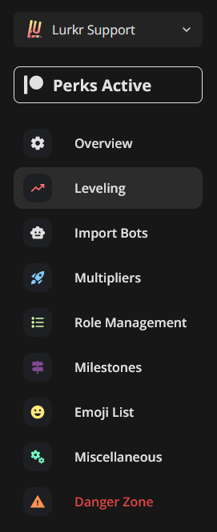
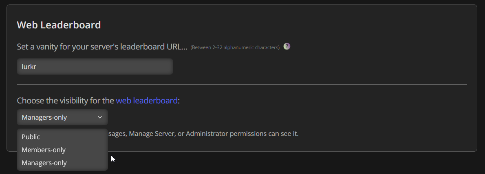

## Why Would You Need This?

By default, the Leaderboard of your server is globally visible, which means it can be searched by robots (indexed) and be put onto Google and other search engines. Sometimes you might not want your server to be publically visible though, if it's just a server for you and your friends, or it's a secret society!

## Make sure you have leveling set up

Before following this guide, please make sure that you have correctly set up leveling in your server already. If you need guidance in doing so, please follow our [Setting Up Server Leveling guide](/bot/guides/setting-up-server-leveling).

---

## Visibility Options

Below is a table showing and explaining the different visibility options you can choose from. These options don't change if you have a [Vanity URL](/bot/guides/setting-a-leaderboard-vanity-url) set or not.

| Visibility Option | Description |
| ----------------- | ----------- |
| Public | Anyone can see it, including non-members. This is the default setting. This means your leaderboard is indexable on the web. |
| Members-only | Only logged-in members of this server can see it. This means your leaderboard will not be indexed on the web. |
| Managers-only | Only people with Manage Messages, Manage Server, or Administrator permissions can see it. This means your leaderboard will not be indexed on the web. |

---

## Setting a Visibility

In order to set your leaderboards' visibility, go to your [servers dashboard](https://lurkr.gg/guilds) and select the **Leveling** category.

Scroll all the way down to the **Web Leaderboard** section, and select your visibility option of choice.

---

## Final Words

And that's it! You've successfully set your leaderboard visibility with Lurkr!

If you need any more assistance with Lurkr, check out the rest of this documentation or join our support server to talk to an actual human!

For more help, see our [Troubleshooting guide](/bot/troubleshooting).