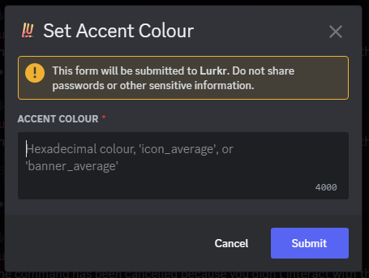
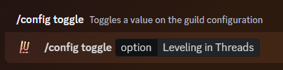
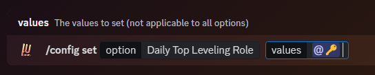
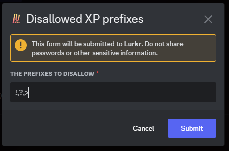

# Setting Up Leveling Multipliers

## Why Would You Need This?

With Lurkr you are in complete control how fast or slow each one of your members can gain levels in your server! Multipliers are the extremely in-depth solution to rewarding certain roles or channels, punishing others, setting pace of the entire leveling system and more!

## Make sure you have leveling set up

Before following this guide, please make sure that you have correctly set up leveling in your server already. If you need guidance in doing so, please follow our [Setting Up Server Leveling guide](/bot/guides/setting-up-server-leveling).

---

## Understanding Multipliers

Multipliers might take some getting used to, but don't worry! That's what this guide is for! Multipliers essentially take the amount of XP a user would normal receive for a valid message, and multiply it by however much the multiplier is set to. For example if a user gains `34` XP for one message, but the server has a global multiplier of x1.5, they will actually receive `51` XP.

However, multipliers can also be set below 1, meaning a multiplier of x0.5 is valid, but that does signify a 50% XP gain, but rather a 50% XP loss. **Any multiplier that is above 1 will give more XP, and any multiplier that is below 1 will take away XP.**

<Callout type="info">
If you prefer to think in percentages; a multiplier of x1.5 equals a 150% XP gain, and a multiplier of x3.4 equals a 340% XP gain.
</Callout>

---

## Understanding the Hierarchy

When you have more than one multiplier currently active, a hierarchy is established to decide which multiplier is used in which circumstance. Role multiplier hierarchy is a bit different and will be explained in the [changing role multiplier hierarchy section](#changing-role-multiplier-hierarchy).

Lets say that we have a global multiplier of x1.1, a channel multiplier of x1.5 in #Channel-A, a channel multiplier of x0.75 in #Channel-B and another #Channel-C with no multiplier:

| Multiplier | Application |
|------------|-------------|
| x1.1 | Global |
| x1.5 | #Channel-A |
| x0.75 | #Channel-B |
| None | #Channel-C |

Based on this, we now want to know what multiplier will be used in each channel.

If we talk in #Channel-A, the multiplier of #Channel-A will be used, since it is the highest one currently applicable.

If we talk in #Channel-B, the global multiplier will be used, since the channel multiplier is lower than the global one.

If we talk in #Channel-C, the global multiplier will be used, since there is no channel multiplier set at all.

<Callout type="default">
**Important to Remember!**

Whenever applicable, the highest multiplier will always be used!
</Callout>

---

## Setting Global Multipliers

Global multipliers, as the name suggests, apply to the entire server regardless of role, channel, permissions, etc. They can be useful when you want to regulate the total leveling gain on your server, for example if you find that your members are gaining levels a bit too quickly, introducing a global multiplier that is less than 1 will lower the amount of levels gained globally. To add a global multiplier, use the `/config set` command for global multiplier.

A modal-box will then appear, in which you can then enter the global multiplier you want to assign.

<Callout type="info">
Using Global Multipliers you can change the leveling curve to match that of other popular bots!
*Assuming Default Leveling Options & Multipliers*

**AmariBot •** x0.09
**Polaris •** x1.1
**Arcane •** Approx. Equal
**MEE6 •** x0.32
</Callout>

---

## Setting Channel Multipliers

Channel multipliers allow you to set multipliers on a per-channel basis.

They also let you set multiple channels to the same multiplier, or set different multipliers for several channels!

To add a channel multiplier, use the `/config set` command for channel multipliers. In the `values` option, you can enter as many channels as your current server plan will allow. You can check the limits on the [Premium Perks page](/bot/information/premium-perks)!

A modal-box will then appear, in which you can then enter the channel multiplier you want to assign.

---

## Setting Role Multipliers

Role multipliers work in much the same way as channel multipliers.

You can assign numerous roles to the same multiplier, or create different multipliers for different roles!

To add a role multiplier, use the `/config set` command for role multipliers. In the `values` option, you can enter as many roles as your current server plan will allow. You can check the limits on the [Premium Perks page](/bot/information/premium-perks)!

A modal-box will then appear, in which you can then enter the role multiplier you want to assign.

---

## Changing Role Multiplier Hierarchy

If you haven't read how the regular multiplier hierarchy works, please read [that section](#understanding-the-hierarchy) first.

Role hierarchy **by default** is managed in the exact same way as all other multipliers; the highest applicable multiplier will be used **regardless** of the role hierarchy.

However, you can change the prioritization of which multiplier is used by toggling it in the configuration.

If you do so, the highest role that a user has that also has a multiplier attached to it will be used, even if a lower ranking role has a higher multiplier.

### Let's Show An Example

Because this feature might be a little too complex to explain in words, here we have two role multipliers setups.

This first setup has the checkmark on the **higher multiplier** even though it is lower in terms of the role hierarchy. This is the **default behaviour**!

This second setup has the checkmark on the **higher role** even though it has a lower multiplier compared to the other. This is the behaviour **when you toggle this feature**.

<Callout type="warning">
**Be Careful!**

This only applies to situations where one user has 2 roles at the same time that both have a multiplier applied to them!
</Callout>

To toggle role hierarchy prioritization, use the `/config toggle` command for role hierarchy.

---

## Toggling Vote Boosting Leveling

Voting helps us get Lurkr seen by lots more people! To help incentivize people to vote for Lurkr we give everyone who voted a **12 hour multiplier** that is applied globally across all servers.

This boost is **20%**, so the equivalent of a 1.2x Multiplier.

Unlike other bots, it is completely free to turn this boost off for you, however if you like what we're doing and can't support us directly with [Lurkr Max](/bot/information/premium-perks) or [Lurkr Ultimate](/bot/information/premium-perks), we would appreciate you leaving this featured turned on!

To toggle vote boosting leveling, use the `/config toggle` command for vote boosting.

---

## Final Words

And that's it! You've successfully learned how to use leveling Multipliers in Lurkr!

If you need any more assistance with Lurkr, check out the rest of this documentation or join our support server to talk to an actual human!

Learn more about [troubleshooting](/bot/information/troubleshooting).