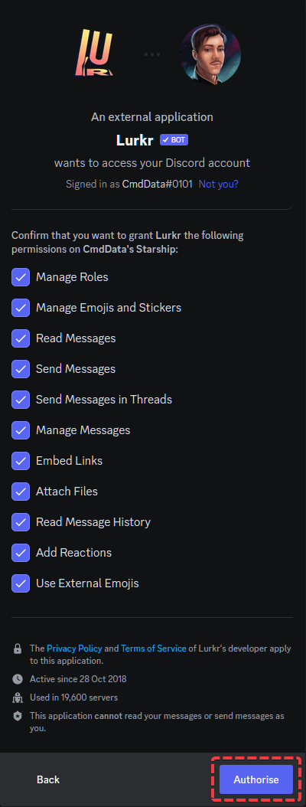
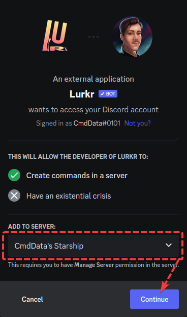

# Getting Started

## Inviting the Bot

To invite Lurkr into your Discord server, go to [https://lurkr.gg/invite](https://lurkr.gg/invite). You will see the following page pop up. On the said page, select the server you want to invite Lurkr onto.

<Callout type="info">
You need **Manage Server** permission on the server you want to add Lurkr to
</Callout>

On the next page, you will see an overview of all the permissions you are about to grant to Lurkr by inviting them onto the server. You may remove permissions by clicking on the check-marks, but please only do this if you know what you're doing, some functionalities of the bot may be lost until you re-grant permissions later.

To confirm, click on Authorize.

You might be prompted to fill out a ReCAPTCHA survey to confirm that you are not a bot. Complete the Captcha and click on Continue.

**Congratulations, you have added Lurkr to your server! Check out these cool guides we've made to get you right into the groove with using Lurkr!**