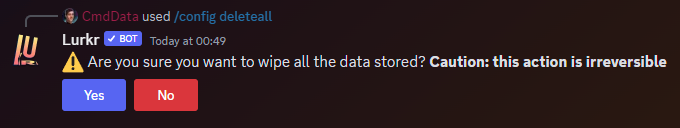

### Description

<Callout type="warning">
	This is a **method** or **sub-command** of the [Config ](./)command. It is not its own command.
</Callout>

This method of the [config ](./)command can be used to delete all of your config options in one go. This command will
not reset/delete any of your personal information, it will only delete server information.

Not only will it delete config options, but it will also delete any other server specific information like for example
the leveling database for your server or also all of user join & leave statistics.

You will receive a prompt that will ask if you are sure that you want to delete all server configurations and
information. Clicking on the yes button will then delete all of the saved server information.

### Command Structure

```
/config deleteall
```



### **Permission**

- `Manage Server`**(User)**
- N/A **(Bot)**
