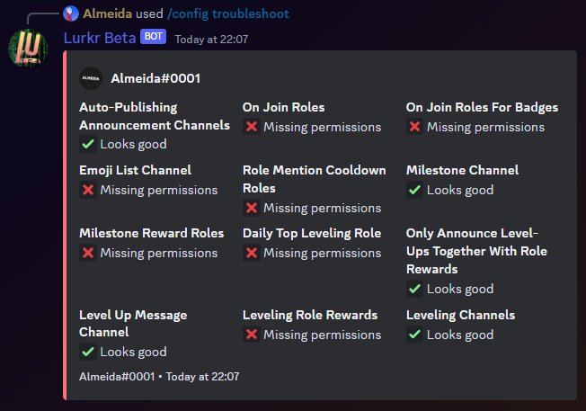

### Description

<Callout type="warning">
	This is a **method** or **sub-command** of the [Config](./) command. It is not its own command.
</Callout>

This method of the [config](./) command can be used to check if features of Lurkr have been correctly configured either
using the dashboard or some of the other methods of the config command.

The troubleshoot embed can tell you whether everything is configured correctly, if a features is turned off (and
therefore won't be checked) or if there is a problem, what is causing it, letting you deduce how you can fix it!

### Command Structure

```
/config troubleshoot
```



### Possible Checks

Below is a list of checks that the troubleshoot command can perform and will alert you of.

This table can also show you in more detail what is meant by each error and how you can generally fix them!

| Error                          |                                                                       Meaning                                                                       |                                                                                                                                                                                Fix |
| ------------------------------ | :-------------------------------------------------------------------------------------------------------------------------------------------------: | ---------------------------------------------------------------------------------------------------------------------------------------------------------------------------------: |
| Channel not found              |                                                    The channel doesn't exist or never did exist.                                                    |                                                Set a channel that does exist to Lurkr. Use channel ID's to tell exactly which channel should be used if there are duplicate names. |
| Invalid channel types          |                         The channel can't be used in this context. For example, voice channels can't be leveling channels.                          |                                                                                                Set a channel that Lurkr does support, like normal text channels or forum channels. |
| Missing permissions on channel |                                               Lurkr doesn't have necessary permission for the channel                                               |                                                                                                       Give Lurkr either server-wide or in the channel the [needed permissions](/). |
| Role not found                 |                                                     The role doesn't exist or never did exist.                                                      |                                                         Set a role that does exist to Lurkr. Use role ID's to tell exactly which role should be used if there are duplicate names. |
| Role not editable              |                                     The role cannot be edited by Lurkr, and therefore can't be given to users.                                      | This cannot be fixed as it happens with integration [managed roles](https://support.discord.com/hc/en-us/articles/360045093012-Server-Integrations-Page). Choose a different role. |
| Role hierarchy incorrect       |                 Lurkr's top most role is below one or more of the roles you want to set, not allowing Lurkr to control those roles.                 | Either move the roles higher than Lurkr's highest role or the opposite. [Learn about role hierarchy](https://support.discord.com/hc/en-us/articles/214836687-Role-Management-101). |
| Too few members for tracking   |                         Member count tracking is enabled but the server has fewer than the minimum required members (100).                          |                                                                                Either disable member count tracking or wait until your server grows past the minimum member count. |
| Invalid XP curve               |                                      The configured XP curve formula is invalid or produces incorrect results.                                      |                                                                                                    Reset the XP curve to a preset or fix the custom coefficients in the dashboard. |
| Announcement config conflict   | Level-up announcement settings conflict with each other (e.g. specific levels don't match factor, or role-only announcements with no role rewards). |                                     Review your announcement settings and ensure they are compatible. See the [level-up messages guide](../../guides/customize-level-up-messages). |
| Leveling channel mode issue    |                             Blacklist mode with no accessible channels, or whitelist mode with no channels configured.                              |                                                                                            Add channels to the leveling channels list, or switch between blacklist/whitelist mode. |

### Permission

- `Manage Server` **(User)**
- N/A **(Bot)**
