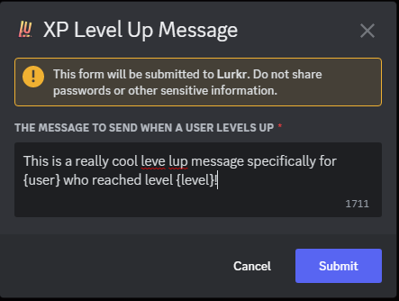

import { SUPPORT_SERVER_INVITE } from "@/shared-links.ts";

## Guide

### Customizing the Level Up Message

If you find the current Level-Up message to not suit your server style, or you simply want to spice it up a little, you
can completely customize it!

<Callout type="info" title="You can also use Embed Messages to congratulate your members!">
	Currently we only support configuring embed messages in the dashboard: [https://lurkr.gg/guilds](/guilds)
</Callout>

This will then open a modal dialog box, in which you can then type and send-off your written out level-up message! When
you're done, and are sure that the message is within the 1,000 character limit, click on the submit button!

There are several **tags** you can include in your Level-Up message. These parameters will be replaced with the
appropriate information when the Level-Up message is sent.

_You must include the `{}` brackets in your message for the tags to show up!_

| Information                    | Parameter              |
| ------------------------------ | ---------------------- |
| User Mention (@User)           | `{user}`               |
| User Profile Picture (🖼️)      | `{user.avatar}`        |
| User Tag (User#1234)           | `{user.tag}`           |
| User Discriminator (1234)      | `{user.discriminator}` |
| User ID (99787644430475264)    | `{user.id}`            |
| Server Name (My Cool Server)   | `{guild.name}`         |
| Server ID (493351982887862283) | `{guild.id}`           |
| Server Icon Picture (🖼️)       | `{guild.icon}`         |
| Level Reached (5)              | `{level}`              |
| Total XP Gained (30,183)       | `{xp}`                 |

---

### Setting the Level Up Message Destination

By default Lurkr will simply send the Level-Up message in the same channel where the user who Leveled-Up last spoke in,
but this can sometimes be intrusive and can disrupt normal conversation.

Not to worry though, as you can set where Lurkr will send the Level-Up message. To set this up, simply type the
following command:

	

The command will reply with a select menu, asking you to select where to send the level up announcement to.

Unless you are selecting a custom channel, simply select an option from the drop-down menu.

	

If you are selecting a custom channel, you must choose the optional slash command option `values` and in the option
field enter the custom channel you want to use.

---

### When to send the Level Up Message

By default, Lurkr will send the Level-Up message after every level increase no matter what. However, you can also
configure the bot to send the message at different times and for different reasons/levels.

This first command lets you set exactly which levels should be announced and which shouldn't. You can include as many
levels as you want, within reason.

Only these levels will then be announced, regardless of where the level-up message will be sent.

	

The next command lets you set from what level on-wards you want the levels to be announced.

This means that any and all levels below this threshold won't be announced, but all of them including the minimum level
will be announced.

	

The next command lets you set if you want levels to only be announced if they are a part of a multiple of a specific
number.

For example if you only want to announce the levels `5`, `10`, `15` and so on, you would set this command to a multiple
of 5.

	

Lastly, you can also additionally toggle whether or not you want to announce **only** the levels that also have a
Leveling Role attached to them.

	

The following table shows you the hierarchy of all of these settings and when they go into effect if you've set multiple
of them. Please refer to this when you're troubleshooting why a certain level isn't being announced.

| Level Announcement Setting | Hierarchy of Announcement |
| -------------------------- | ------------------------- |
| Minimum Level              | 1                         |
| Manually Set Levels        | 2                         |
| Only Leveling Roles        | 3                         |
| Multiple (Factor) Of       | 4                         |

<Callout type="info">
	By this table, if you have manually set levels **1**, **2** & **3** to have an announcement, but also set a **multiple
	of 5**, the only level that would be left out with be **level 4**.
</Callout>

---

### Final Words

And that's it! You've successfully learnt how to customize level up messages!

If you need any more assistance with Lurkr, check out the rest of this documentation or join our support server to talk
to an actual human!

<Cards>
	<Card href="/docs/troubleshooting" title="🐛 Still need help?">
		Check out the Troubleshooting guide!
	</Card>
	<Card href={SUPPORT_SERVER_INVITE} title="💬 Want to chat with an actual human?">
		Join our support server
	</Card>
</Cards>
