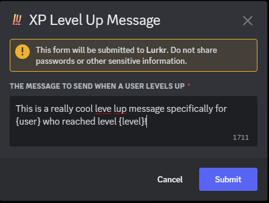

import { SUPPORT_SERVER_INVITE } from "@/shared-links.ts";

## Guide

### Customizing the Level Up Message

If you find the current Level-Up message to not suit your server style, or you simply want to spice it up a little, you
can completely customize it!

<Callout type="info" title="You can also use Embed Messages to congratulate your members!">
	Currently we only support configuring embed messages in [the dashboard](/../guilds).
</Callout>

<center></center>

This will then open a modal dialog box, in which you can then type and send-off your written out level-up message! When
you're done, and are sure that the message is within the 1,800 character limit, click on the submit button!

<center></center>

There are several **tags** you can include in your Level-Up message. These parameters will be replaced with the
appropriate information when the Level-Up message is sent.

_You must include the `{}` brackets in your message for the tags to show up!_

| Information                    | Parameter              |
| ------------------------------ | ---------------------- |
| User Mention (@User)           | `{user}`               |
| User Profile Picture (🖼️)      | `{user.avatar}`        |
| User Tag (User#1234)           | `{user.tag}`           |
| User Discriminator (1234)      | `{user.discriminator}` |
| Username (User)                | `{user.username}`      |
| User ID (99787644430475264)    | `{user.id}`            |
| Server Name (My Cool Server)   | `{guild.name}`         |
| Server Name (My Cool Server)   | `{guild}`              |
| Server ID (493351982887862283) | `{guild.id}`           |
| Server Icon Picture (🖼️)       | `{guild.icon}`         |
| Level Reached (5)              | `{level}`              |
| Total XP Gained (30,183)       | `{xp}`                 |
| Role Reward Gained (Level 10)  | `{roleRewardNames}`    |
| Role Reward Gained (@Level 10) | `{roleRewardMentions}` |

`{roleRewards}` is also available as a legacy alias for `{roleRewardNames}`.

---

### Conditional Variables

You can toggle whether or not a certain section of your level up message shows up by using conditional variables!

Simply use a variable at the start and end of the message you'd like to conditionally show, and add a `#` and `/` to the
start and end of the conditional variables respectfully.

Lurkr will then check if the variable you've select is `true` or `false`, and will only show the message if it's true.

Example:

```
{#roleRewardNames}You gained the {roleRewardNames} roles!{/roleRewardNames}
```

---

### Setting the Level Up Message Destination

By default Lurkr will simply send the Level-Up message in the same channel where the user who Leveled-Up last spoke in,
but this can sometimes be intrusive and can disrupt normal conversation.

Not to worry though, as you can set where Lurkr will send the Level-Up message. To set this up, simply type the
following command:

<center>
	
</center>

The command will reply with a select menu, asking you to select where to send the level up announcement to.

Unless you are selecting a custom channel, simply select an option from the drop-down menu.

<center>
	
</center>

If you are selecting a custom channel, you must choose the optional slash command option `values` and in the option
field enter the custom channel you want to use.

---

### When to send the Level Up Message

By default, Lurkr will send the Level-Up message after every level increase no matter what. However, you can also
configure the bot to send the message at different times and for different reasons/levels.

This first command lets you set exactly which levels should be announced and which shouldn't. You can include as many
levels as you want, within reason.

Only these levels will then be announced, regardless of where the level-up message will be sent.

<center>
	
</center>

The next command lets you set from what level on-wards you want the levels to be announced.

This means that any and all levels below this threshold won't be announced, but all of them including the minimum level
will be announced.

<center>
	
</center>

The next command lets you set if you want levels to only be announced if they are a part of a multiple of a specific
number.

For example if you only want to announce the levels `5`, `10`, `15` and so on, you would set this command to a multiple
of 5.

<center>
	
</center>

Lastly, you can also additionally toggle whether or not you want to announce **only** the levels that also have a
Leveling Role attached to them.

<center>
	
</center>

All active announcement filters must be satisfied **simultaneously** (AND logic) for a level-up to be announced. If you
have multiple settings enabled, a level must pass **every** check to trigger an announcement.

| Level Announcement Setting | What it checks                                       |
| -------------------------- | ---------------------------------------------------- |
| Minimum Level              | The level must be at or above this threshold         |
| Manually Set Levels        | The level must be in the specified list              |
| Only Leveling Roles        | The level must have a role reward attached to it     |
| Multiple (Factor) Of       | The level must be a multiple of the specified number |

<Callout type="warning">
	Because all active filters are combined with AND logic, setting specific levels **1**, **2** & **3** together with a
	**multiple of 5** would mean **no levels are announced** — since no level satisfies both conditions at once. Only use
	multiple announcement filters together when they are compatible.
</Callout>

---

### Final Words

And that's it! You've successfully learnt how to customize level up messages!

If you need any more assistance with Lurkr, check out the rest of this documentation or join our support server to talk
to an actual human!

<Cards>
	<Card href="/troubleshooting" title="🐛 Still need help?">
		Check out the Troubleshooting guide!
	</Card>
	<Card href={SUPPORT_SERVER_INVITE} title="💬 Want to chat with an actual human?">
		Join our support server
	</Card>
</Cards>
