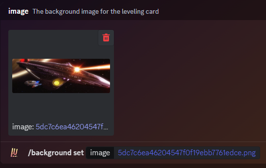

### Description

<Callout type="warning">
	This is a **method** or **sub-command** of the [Background](./) command. It is not its own command.
</Callout>

This method of the [background](./) command can be used to set a leveling background if none has been set yet, or can
also be used to replace an existing custom leveling background with a new one.

Your custom background needs to have a wide aspect ratio to fit into the leveling card. The recommended aspect ratio is
**4:1** (e.g. 1600x400), but any image with at least a **2.5:1** ratio is accepted. The bot will tell you if the image
you have provided is inadequate. If your image only strays slightly from the required aspect ratio, the bot will try to
compensate and cut off any excess to make the image fit.

Accepted file types are **JPEG**, **PNG**, and **WebP**, with a maximum file size of **5 MB**.

For the best possible result we recommend that you crop your image manually to fit the aspect ratio before setting it.

<Callout type="warning">
**Someone Uploaded an NSFW/Inappropriate Image!**

You can now use the [/background report](./report) command in order to report the image to the Support Team, where each
report is analyzed by a human to determine if it violates the Discord Terms of Service.

</Callout>

### Command Structure

```
/background set <image:>
```



### Permission

- N/A **(User)**
- N/A **(Bot)**
