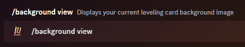

### Description

<Callout type="warning">
	This is a **method** or **sub-command** of the [Background](./) command. It is not its own command.
</Callout>

This method of the [background](./) command can be used to view your custom leveling background if you have set one. It
cannot be used to view the default 'Wavy Grey' background. The custom image will be displayed without any leveling items
obstructing it.

This command can be useful if you want to switch to a different custom background but want to save your current custom
background with the correct aspect ratio.

### Command Structure

```
/background view
```



### Permission

- N/A **(User)**
- `Attach Files` **(Bot)**
