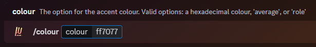

### Description

This command can be used to change the colour of the progression bar in the [level](./rank) command. The colour change
is global, no matter on which server you use the command.

By default, the progression bar is set to the **average** value, which will calculate the average colour of your profile
picture and use it as the bar colour. If you have a GIF profile picture, it will calculate the average colour from the
first frame.

You can also set the progression bar to the **role** value. This will take your top-most role that has a colour
(Transparent roles, or roles with the "Default" colour don't count) and use it as the bar colour.

If you set this value the colour will change between servers, depending on the role colour that you have. If you don't
have any roles, or only have transparent or "Default" roles, the bot will revert to using your profile picture to
calculate an average value.

Lastly, you can also set the progression bar to a **custom colour** value. This lets you completely customize the bar
colour to whatever colour you want, provided you give a correct [hex code](https://www.color-hex.com/).

<Callout type="info">
**Special Hint!**

If you set your rank progress colour to a hex code, it will also show up on the website leaderboard!
[https://lurkr.gg/levels/](https://lurkr.gg/levels/)

</Callout>

### Command Structure

```
/colour [colour:]
```

| Value                   |                                                   Description |
| ----------------------- | ------------------------------------------------------------: |
| Hex Code (e.g. #2ecc71) |                Sets the colour to your custom hex colour code |
| Named Colour (e.g. red) |                    Sets the colour to a CSS/HTML named colour |
| Avatar                  | Sets the colour to the average colour of your profile picture |
| Role                    |       Sets the colour to the role colour of your highest role |

Omitting the colour parameter resets it to the default (average colour of your profile picture).



### Named Colours

The following named colours are accepted:

| Name                    | Hex       | Name                   | Hex       |
| ----------------------- | --------- | ---------------------- | --------- |
| Alice Blue              | `#f0f8ff` | Antique White          | `#faebd7` |
| Aqua                    | `#00ffff` | Aquamarine             | `#7fffd4` |
| Azure                   | `#f0ffff` | Beige                  | `#f5f5dc` |
| Bisque                  | `#ffe4c4` | Black                  | `#000000` |
| Blanched Almond         | `#ffebcd` | Blue                   | `#0000ff` |
| Blue Violet             | `#8a2be2` | Blurple                | `#5865F2` |
| Brown                   | `#a52a2a` | Burlywood              | `#deb887` |
| Cadet Blue              | `#5f9ea0` | Chartreuse             | `#7fff00` |
| Chocolate               | `#d2691e` | Coral                  | `#ff7f50` |
| Cornflower Blue         | `#6495ed` | Cornsilk               | `#fff8dc` |
| Crimson                 | `#dc143c` | Cyan                   | `#00ffff` |
| Dark Blue               | `#00008b` | Dark Cyan              | `#008b8b` |
| Dark Goldenrod          | `#b8860b` | Dark Gray / Grey       | `#a9a9a9` |
| Dark Green              | `#006400` | Dark Khaki             | `#bdb76b` |
| Dark Magenta            | `#8b008b` | Dark Olive Green       | `#556b2f` |
| Dark Orange             | `#ff8c00` | Dark Orchid            | `#9932cc` |
| Dark Red                | `#8b0000` | Dark Salmon            | `#e9967a` |
| Dark Sea Green          | `#8fbc8f` | Dark Slate Blue        | `#483d8b` |
| Dark Slate Gray / Grey  | `#2f4f4f` | Dark Turquoise         | `#00ced1` |
| Dark Violet             | `#9400d3` | Deep Pink              | `#ff1493` |
| Deep Sky Blue           | `#00bfff` | Dim Gray / Grey        | `#696969` |
| Dodger Blue             | `#1e90ff` | Firebrick              | `#b22222` |
| Floral White            | `#fffaf0` | Forest Green           | `#228b22` |
| Fuchsia                 | `#EB459E` | Gainsboro              | `#dcdcdc` |
| Ghost White             | `#f8f8ff` | Gold                   | `#ffd700` |
| Goldenrod               | `#daa520` | Gray / Grey            | `#808080` |
| Green                   | `#008000` | Green Yellow           | `#adff2f` |
| Honeydew                | `#f0fff0` | Hot Pink               | `#ff69b4` |
| Indian Red              | `#cd5c5c` | Indigo                 | `#4b0082` |
| Ivory                   | `#fffff0` | Khaki                  | `#f0e68c` |
| Lavender                | `#e6e6fa` | Lavender Blush         | `#fff0f5` |
| Lawn Green              | `#7cfc00` | Lemon Chiffon          | `#fffacd` |
| Light Blue              | `#add8e6` | Light Coral            | `#f08080` |
| Light Cyan              | `#e0ffff` | Light Goldenrod Yellow | `#fafad2` |
| Light Gray / Grey       | `#d3d3d3` | Light Green            | `#90ee90` |
| Light Pink              | `#ffb6c1` | Light Salmon           | `#ffa07a` |
| Light Sea Green         | `#20b2aa` | Light Sky Blue         | `#87cefa` |
| Light Slate Gray / Grey | `#778899` | Light Steel Blue       | `#b0c4de` |
| Light Yellow            | `#ffffe0` | Lime                   | `#00ff00` |
| Lime Green              | `#32cd32` | Linen                  | `#faf0e6` |
| Magenta                 | `#ff00ff` | Maroon                 | `#800000` |
| Medium Aquamarine       | `#66cdaa` | Medium Blue            | `#0000cd` |
| Medium Orchid           | `#ba55d3` | Medium Purple          | `#9370db` |
| Medium Sea Green        | `#3cb371` | Medium Slate Blue      | `#7b68ee` |
| Medium Spring Green     | `#00fa9a` | Medium Turquoise       | `#48d1cc` |
| Medium Violet Red       | `#c71585` | Midnight Blue          | `#191970` |
| Mint Cream              | `#f5fffa` | Misty Rose             | `#ffe4e1` |
| Moccasin                | `#ffe4b5` | Navajo White           | `#ffdead` |
| Navy                    | `#000080` | Old Lace               | `#fdf5e6` |
| Olive                   | `#808000` | Olive Drab             | `#6b8e23` |
| Orange                  | `#ffa500` | Orange Red             | `#ff4500` |
| Orchid                  | `#da70d6` | Pale Goldenrod         | `#eee8aa` |
| Pale Green              | `#98fb98` | Pale Turquoise         | `#afeeee` |
| Pale Violet Red         | `#db7093` | Papaya Whip            | `#ffefd5` |
| Peach Puff              | `#ffdab9` | Peru                   | `#cd853f` |
| Pink                    | `#ffc0cb` | Plum                   | `#dda0dd` |
| Powder Blue             | `#b0e0e6` | Purple                 | `#800080` |
| Red                     | `#ff0000` | Rosy Brown             | `#bc8f8f` |
| Royal Blue              | `#4169e1` | Saddle Brown           | `#8b4513` |
| Salmon                  | `#fa8072` | Sandy Brown            | `#f4a460` |
| Sea Green               | `#2e8b57` | Seashell               | `#fff5ee` |
| Sienna                  | `#a0522d` | Silver                 | `#c0c0c0` |
| Sky Blue                | `#87ceeb` | Slate Blue             | `#6a5acd` |
| Slate Gray / Grey       | `#708090` | Snow                   | `#fffafa` |
| Spring Green            | `#00ff7f` | Steel Blue             | `#4682b4` |
| Tan                     | `#d2b48c` | Teal                   | `#008080` |
| Thistle                 | `#d8bfd8` | Tomato                 | `#ff6347` |
| Turquoise               | `#40e0d0` | Violet                 | `#ee82ee` |
| Wheat                   | `#f5deb3` | White                  | `#ffffff` |
| White Smoke             | `#f5f5f5` | Yellow                 | `#ffff00` |
| Yellow Green            | `#9acd32` |                        |           |

### Permission

- N/A **(User)**
- N/A **(Bot)**
