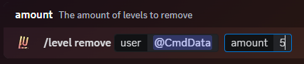

### Description

This command can be used to remove a user's levels on demand.

The user you want to remove levels from **does** need to have prior levels.

The levels you specify in the command will be removed from their current levels.

### Command Structure

```
/level remove <user:> <amount:>
```



### Permission

- `Manage Messages` **(User)**
- N/A **(Bot)**
