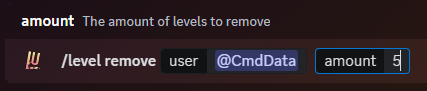

### Description

This command can be used to remove a users levels on demand.

The user you want to remove levels from **does** need to have prior levels.

The levels you specify in the command will be removed from their current levels.

If you want to add levels to a user that already has some, you can use the [level add](./add) command

### Command Structure

```
/level remove <user:> <amount:> [announce:]
```

The optional `announce` parameter allows you to control whether a level up announcement should be sent if the user levels up as a result of this command (only applies if level up announcements are enabled on your server).



### **Permission**

- `Manage Server`**(User)**
- N/A **(Bot)**
