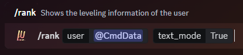

### Description

This command can be used to view your current level, how many levels you have gained, how much XP you need to advance to
the next level, and also shows you a progress bar to the next level.

You can also input another user on the server to view their leveling information. The same information will be shown as
with your leveling information.

You also have the option to send a `text_only` rank card which sends the information without the image rank card. This
can be useful if the image isn't being displayed properly on your device of if you are trying to save data bandwidth.

### Command Structure

```
/rank [user:] [text_mode:]
```



### **Permission**

- N/A **(User)**
- `Attach Files`**(Bot)**
