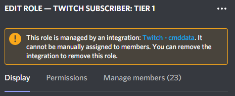

import { SUPPORT_SERVER_INVITE } from "@/shared-links.ts";

<Callout type="info">
    **We've Automated Troubleshooting (Almost)**

    With our new [/config troubleshoot](/config-commands/config/troubleshoot) command you can quickly check the most common issues with your setup!

</Callout>

## Leveling Roles aren't being Assigned!

If you think you have set up the Leveling roles correctly, but users aren't getting them when they level up or when they
use the `/syncrolerewards` command, follow these steps in order to fix your issue! These steps are also the same when
troubleshooting the Top Leveling role.

### 1. Make sure the bot has 'Manage roles' permission

The bot needs to have this permission in order to assign roles. If you're new to Discord, a lot of different permissions
are bundled under one permission umbrella, and giving the manage roles permission also grants users access to assign
roles.

Check this official guide by Discord to learn how to change role permissions:
https://support.discord.com/hc/articles/214836687-Discord-Roles-and-Permissions

### 2. Make sure the roles you want to assign are below the bot on the role list

Another common issue is that the bot **DOES** have the manage roles permission, but the highest bot role (i.e., The
top-most role that the bot is assigned to) is lower down in the role-ranking than the roles you want it to assign.
Hierarchy moves from the top to the bottom, so make sure that the bot always has a role that's above the Leveling roles.

### 3. Make sure the roles you want to assign aren't integration managed

Integration managed means that the role you want to assign is being used by an external bot or integration. Below is
what you will see at the top of the role edit page when the role is managed by an integration.

### 4. It's still not working!

If the bot still isn't assigning the Leveling roles, join our support server and create a post in our support forum
channel. Make sure to include all of your troubleshooting steps and screenshots!

<Card href={SUPPORT_SERVER_INVITE} title="Discord">
	Join our support server
</Card>
