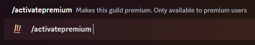

## Description

This command can be used to activate the $5 Patreon perks (Guild/Tier 2 subscription) on one server.

If you want to activate premium on your server, consider checking out the many [Patreon Perks](../premium-perks) you
will get!

## Command Structure

```
/activatepremium
```



## Permission

- N/A **(User)**
- N/A **(Bot)**
