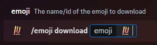

### Description

<Callout type="warning">
	This is a **method** or **sub-command** of the [Emoji](./) command. It is not its own command.
</Callout>

This command can be used to download emojis or emotes from your server or other servers. Lurkr does not need to be in
the same server as the emoji in order to download it.

As well as custom emojis, Lurkr can also download default emojis through the Discord emoji menu.

### Command Structure

```
/emoji download <emoji:>
```



### Permission

- N/A **(User)**
- `Manage Guild Expressions` **(Bot)**
