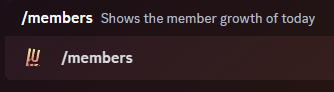
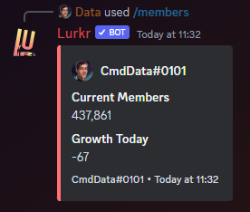

### Description

This command can be used to display the total number of users in your server and if the data is available, the user
growth today.

Note that the bot can only display user growth while it is in your server. As long as it isn't in your server it cannot
track users in any way.

Please also note that by toggling the configuration option `Member Join/Leave Tracking` it will prevent the bot from
tracking users even while it is still in the server.

### Command Structure

```
/members
```





### Permission

- N/A **(User)**
- `Embed Links` **(Bot)**
