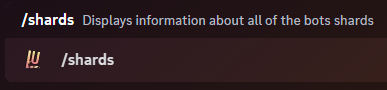

### Description

<Callout type="warning">This is a diagnostic command, not intended for regular users.</Callout>

This command can be used to display the number of shards that the bot is currently using, along with the total number of
guilds per shard, ping, memory usage, and uptime. The compact mode omits the ping column.

### Command Structure

```
/shards [compact:]
```

| Option  | Description                                                         | Required |
| ------- | ------------------------------------------------------------------- | -------- |
| compact | Display a compact version of the table suitable for smaller screens | No       |



### Permission

- N/A **(User)**
- N/A **(Bot)**
