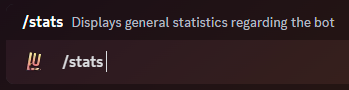

### Description

<Callout type="warning">This is a diagnostic command, not intended for regular users.</Callout>

This command can be used to display the total number of guilds across all shards, total number of users, total number of
shards, latency to the API, total memory usage, the version number of Node.js, total uptime, important bot-related
links, the last GitHub commit, and the shard number your server is currently being hosted on.

### Command Structure

```
/stats
```



### Permission

- N/A **(User)**
- `Embed Links` **(Bot)**
